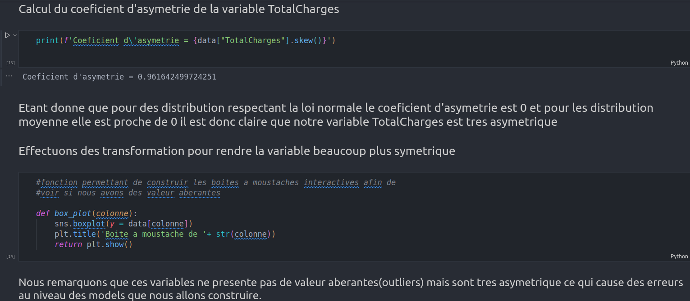
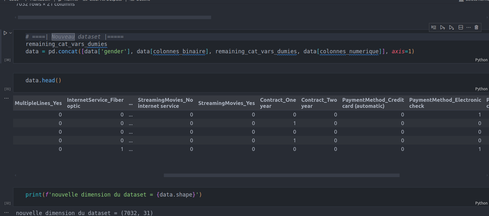
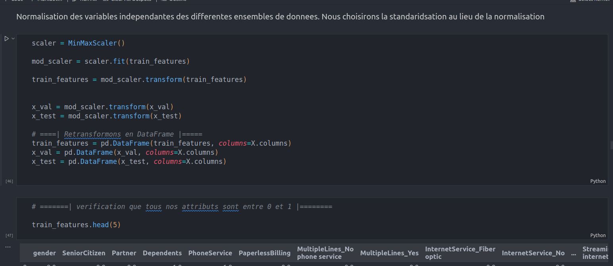
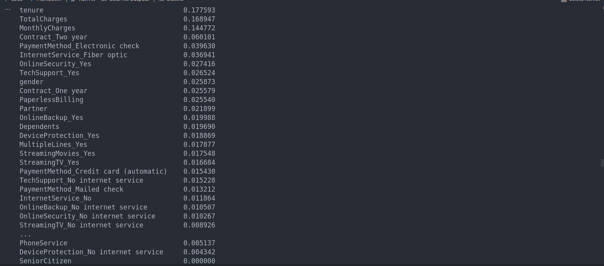

  

<h3 align="center">customer-churn-solution</h3>

<!-- 

 -->

---

 🤖 Few lines describing what your bot does.
      

## 📝 Table of Contents

- [About](#about)
- [Demo / Working](#demo)
- [How it works](#working)
- [Usage](#usage)
- [Getting Started](#getting_started)
- [Built Using](#built_using)
- [Authors](#authors)
- [Acknowledgments](#acknowledgement)

## 🧠About 

Solution permettant de predire les les clients succeptible de se desabonner afin d'orienter les campagnes marketing vers eux. cela permetra a l'entreprise de reduire les depenses dans le marketing et de mieux comprendre les raisons de desabonnement de ses clients.

## 🥠Demo / Working 

## 💭 How it works 

Dans ce projet, nous procedons d'abord a l'importation des
outils necessair.

Puis nous continuons avec l'importation des donnees et l'analyse exploratoire qui nous a permis de mieux comprendre les donnees grace aux differentes metriques et graphiques.

Par la suite nous avons enchaine avec le pretraitement qui nous a permis de supprimer les valeurs manquante, encoder les variables categorielles, et rendre les donnees symetriques.

Nous avons poursuivis avec la division des donnees entrainement, validation et test. Puis nous avons equilibrer les classes en utilisant un le sur-echantillonnement et le sous-echantillonement. Et nous avons conserves les donnees obtenue apres sur echantillonement.

Puis nous avons effectuer une reduction de la dimensionnalite en utilisant dans un premier temps l'algorithme de la foret aleatoire pour classer les proprietes par ordre d'importance et dans un second la recursive feature eliminator.Elles nous ont permis de rester au final avec 09 proprietes sur 28.

Nous avons termine avec l'entrainement des modeles en utilisant plusieurs algorihtme et en recherchant a chaque fois les meilleurs hyper-parametres grace a la bibliotheque GirdSearchCV et afin le meilleur modele a ete choisi.

## 🈠Usage 

Pour utilise ce projet,
vous devez lire et comprendre la problematique, puis par courir les differentes etapes de realisation en lisant les commentaires

## 🏁 Getting Started 

telecharger le fichier .zip decompresser dans votre machine puis l'ouvrir avec un note book et selectionner le kernel qui contien toutes les bibliotheques necessaires.

### Prerequisites

 - Avoir python3 installer
 - Avoir un interpreteur de note book comme jupiter
 - Avoir les outils suivant installer:
    `pandas`
    `numpy`
    `seaborn`
    `matplotlib`
    `ipywidgets`
    `sklearn`

## ⛏️ Built Using 

Ouvrir le fichier .ipynb dans jupiter note book
## ✍️ Authors 

- [@kylelobo](https://github.com/pharaminus) - Idea & Initial work
Balekamen babatack landry

## 🉠Acknowledgements 

- Inspiration: Josue Afouda

